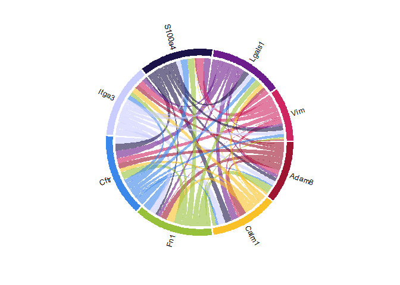

Figure template
================
Yuhao Chi
2025-04-04

- [Using color blind tested colors](#using-color-blind-tested-colors)
- [Barplot](#barplot)
  - [Common barplot with different
    groups](#common-barplot-with-different-groups)
  - [Horizontal Barplot](#horizontal-barplot)
  - [Barplot with error bar and
    comparison](#barplot-with-error-bar-and-comparison)
  - [Barplot with error bar and comparison and
    pvalue](#barplot-with-error-bar-and-comparison-and-pvalue)
  - [Stacked barplot](#stacked-barplot)
  - [Stacked barplot with different
    condifitons](#stacked-barplot-with-different-condifitons)
- [Line plot and dot plot](#line-plot-and-dot-plot)
  - [Common line plot with dots](#common-line-plot-with-dots)
  - [Common line plot with dots and
    background](#common-line-plot-with-dots-and-background)
  - [Common line plot with dots, background and eror
    bar](#common-line-plot-with-dots-background-and-eror-bar)
  - [Common line plot with different groups and error
    bar](#common-line-plot-with-different-groups-and-error-bar)
  - [Common dot plot with linear
    regression](#common-dot-plot-with-linear-regression)
  - [Common dot plot with loess
    regression](#common-dot-plot-with-loess-regression)
- [Dotplot comparison](#dotplot-comparison)
  - [Common dot plot used in GO/KEGG](#common-dot-plot-used-in-gokegg)
  - [Common dot plot compare with different
    conditions](#common-dot-plot-compare-with-different-conditions)
  - [Volcano plot](#volcano-plot)
- [Boxplot and violin plot](#boxplot-and-violin-plot)
  - [Common boxplot plot wth pvalue](#common-boxplot-plot-wth-pvalue)
  - [Violin plot wth boxplot and dot
    inside](#violin-plot-wth-boxplot-and-dot-inside)
  - [Violin plot wth dot inside](#violin-plot-wth-dot-inside)
- [Cicular plot](#cicular-plot)
- [Venn plot](#venn-plot)
  - [Compare 3 groups](#compare-3-groups)
  - [Compare 4 groups](#compare-4-groups)
  - [Upset Compare more than 6
    groups](#upset-compare-more-than-6-groups)
- [Heatmap](#heatmap)
  - [Common heatmap](#common-heatmap)
  - [Upper triangular correlation
    matrix](#upper-triangular-correlation-matrix)
  - [Complex heatmap](#complex-heatmap)

## Using color blind tested colors

``` r
get_color_list = function(n){
  indeces = c(1,11,5,7,15,14,16,13,6,9,17,2,10,8,3,4,12,18)
  
  if(n>18) stop("n must be 18 or smaller")
  c("#9E1531","#C66A27","#F3953A","#C9971D","#F9C027","#DDE48A",
    "#97C13A","#64A638","#174E3F","#43ADA8","#3C87EA","#7863A9",
    "#C9CDFF","#1C124A","#6D1C8C","#CF2561","#EC8483","#ECAFC6")[sort(indeces[1:n])]
}
```

## Barplot

#### Common barplot with different groups

``` r
library(ggplot2)

df <- data.frame(
  cell_type = c("naive", "MZ", "B1", "IFN-induced", 
                "Mitotic GC LZ", "Apoptotic GC LZ", 
                "Memory", "PC", "GC DZ"),
  fold_change = c(1.0, 0.8, 0.9, 7.0, 
                  1.2, 2.0, 
                  3.0, 1.1, 0.2)
)

n_groups <- length(unique(df$cell_type))
my_colors <- get_color_list(n_groups)

p <- ggplot(df, aes(x = cell_type, y = fold_change)) +
  geom_bar(stat = "identity", aes(fill = cell_type)) +
  scale_fill_manual(values = my_colors) +
  #coord_flip() +
  labs(x = "Relative Fold Change (d14 vs d0)", y = "") +
  theme_classic() +
  theme(legend.position = "none", axis.line = element_line(color = "black"), text = element_text(color = "black"))

print(p)
```

<!-- -->

#### Horizontal Barplot

``` r
library(ggplot2)

# Create example data
df <- data.frame(
  cell_type = c("naive", "MZ", "B1", "IFN-induced", 
                "Mitotic GC LZ", "Apoptotic GC LZ", 
                "Memory", "PC", "GC DZ"),
  fold_change = c(1.0, 0.8, 0.9, 7.0, 
                  1.2, 2.0, 
                  3.0, 1.1, 0.2)
)

# Order the factor so that the plot displays the groups in the desired order (top to bottom)
df$cell_type <- factor(df$cell_type, levels = rev(df$cell_type))
n_groups <- length(unique(df$cell_type))
my_colors <- get_color_list(n_groups)

# Create the plot
p <- ggplot(df, aes(x = cell_type, y = fold_change, fill = cell_type)) +
  # Create the barplot using identity statistic
  geom_bar(stat = "identity") +
  # Flip coordinates to generate a horizontal barplot
  coord_flip() +
  # Apply the custom fill colors
  scale_fill_manual(values = my_colors) +
  # Set axis labels (y label left blank)
  labs(
    x = "Relative Fold Change (d14 vs d0)",
    y = ""
  ) +
  # Use a classic theme to remove the background while keeping axis lines
  theme_classic() +
  # Customize the theme: remove legend, set axis lines and all text to black
  theme(
    legend.position = "none",
    axis.line = element_line(color = "black"),
    text = element_text(color = "black")
  )

# Display the plot
print(p)
```

<!-- -->

#### Barplot with error bar and comparison

``` r
# Load required packages
library(ggplot2)
library(ggpubr)

# Create example data
df <- data.frame(
  group     = rep(c("Group1", "Group2", "Group3", "Group4"), each = 3),
  replicate = rep(1:3, times = 4),
  value     = c(2.0, 2.5, 1.8,    # Group1 replicates
                5.0, 4.8, 5.3,    # Group2 replicates
                8.0, 9.0, 7.5,    # Group3 replicates
                4.0, 4.5, 5.2)    # Group4 replicates
)

n_groups <- length(unique(df$group))
my_colors <- get_color_list(n_groups)

# Create the plot with significance annotations
p <- ggplot(df, aes(x = group, y = value, fill = group)) +
  # Bar plot showing mean values
  stat_summary(fun = mean, geom = "col", width = 0.6, color = "black", alpha = 0.6) +
  # Add error bars (mean ± SE)
  stat_summary(fun.data = mean_se, geom = "errorbar", width = 0.2) +
  scale_fill_manual(values = my_colors) +
  # Plot individual data points with jitter
  geom_jitter(aes(color = group), width = 0.1, size = 2, shape = 16) +
  # Add pairwise significance comparisons with custom label positions
  stat_compare_means(
    comparisons = list(c("Group1", "Group2"),
                       c("Group2", "Group3"),
                       c("Group3", "Group4")),
    label = "p.signif",
    method = "t.test",
    label.y = c(9, 9.5, 11)  # Adjust the y positions for the annotations
  ) +
  # Set axis labels
  labs(
    x = NULL,
    y = "Fold change (log2)"
  ) +
  # Extend the y-axis limit and disable clipping so annotations are fully visible
  coord_cartesian(ylim = c(0, 12), clip = "off") +
  # Apply a classic theme with black text and axis lines
  theme_classic() +
  theme(
    text = element_text(color = "black"),
    axis.line = element_line(color = "black"),
    legend.position = "none",
    # Increase plot margins to provide extra space for annotations
    plot.margin = margin(10, 20, 10, 10)
  )

# Display the plot
print(p)
```

<!-- -->

#### Barplot with error bar and comparison and pvalue

``` r
# ---------------------------
# 1) Load packages
# ---------------------------
library(ggplot2)
library(ggpubr)   # for stat_compare_means()

# ---------------------------
# 2) Example Data
# ---------------------------
# Suppose we have 5 time points: 0, 5, 10, 14, 28 days
# Each has 8 replicates. The values represent log2 fold change (dummy data).
set.seed(123)  # for reproducibility
df <- data.frame(
  Day  = factor(rep(c("0", "5", "10", "14", "28"), each = 8),
                levels = c("0", "5", "10", "14", "28")),
  Value = c(
    rnorm(8, mean = 0.5, sd = 0.3),   # Day 0
    rnorm(8, mean = 2.0, sd = 0.5),   # Day 5
    rnorm(8, mean = 3.0, sd = 0.7),   # Day 10
    rnorm(8, mean = 3.5, sd = 0.6),   # Day 14
    rnorm(8, mean = 1.5, sd = 0.4)    # Day 28
  )
)
n_groups <- length(unique(df$Day))
my_colors <- get_color_list(n_groups)

# ---------------------------
# 3) Basic Plot Setup
# ---------------------------
p <- ggplot(df, aes(x = Day, y = Value, fill = Day)) +
  # 3a) Mean bar (± SE) using stat_summary
  stat_summary(fun = mean, geom = "col", width = 0.6, 
               color = "black", alpha = 0.6) +
  stat_summary(fun.data = mean_se, geom = "errorbar", 
               width = 0.2) +
  scale_fill_manual(values = my_colors) +
  
  # 3b) Individual data points (jittered)
  geom_jitter(shape = 21, size = 2, width = 0.15, stroke = 0.5) +
  
  # 3c) Horizontal reference line at y=0 (log2 fold change baseline)
  geom_hline(yintercept = 0, color = "black") +
  
  # 3d) Pairwise significance tests (example: comparing adjacent time points)
  #     If you'd like different comparisons, modify the list below.
  stat_compare_means(
    method = "t.test",
    label  = "p.format",  # show numeric p-value
    comparisons = list(
      c("0",  "5"),
      c("5",  "10"),
      c("10", "14"),
      c("14", "28")
    ),
    # Manually set y-positions for each bracket so they don't overlap
    label.y = c(4.8, 5.3, 5.8, 6.3)
  ) +
  
  # 3e) Axis labels and theme
  labs(
    x = "Days",
    y = expression(paste("Abca1 (log"[2], "(FC))")),
    title = "Example: DSS vs. Water over Time"
  ) +
  coord_cartesian(ylim = c(-0.5, 7)) +  # expand y-axis as needed
  theme_classic() +
  theme(
    text = element_text(color = "black"),
    axis.line = element_line(color = "black"),
    legend.position = "none",       # remove legend (optional)
    plot.margin = margin(10, 20, 10, 10)  # extra space for p-value labels
  )

# ---------------------------
# 4) Display the Plot
# ---------------------------
print(p)
```

<!-- -->

#### Stacked barplot

``` r
# 1) Load ggplot2
library(ggplot2)

# 2) Example data (dummy values)
#    Two diets (STD, GW3965) and five categories of "Number of de novo buds."
#    Percentages sum to ~100 for each diet (adjust as needed).
df <- data.frame(
  Diet = factor(rep(c("STD", "GW3965"), each = 5), levels = c("STD", "GW3965")),
  buds = factor(
    rep(c("0 (<0.0001)", "1 (0.2330)", "2 (0.0213)", "3 (0.0460)", "≥4 (0.0004)"), 2),
    levels = c("0 (<0.0001)", "1 (0.2330)", "2 (0.0213)", "3 (0.0460)", "≥4 (0.0004)")
  ),
  percentage = c(40, 15, 15, 10, 20,   # STD (dummy values)
                 30, 20, 20, 15, 15)  # GW3965 (dummy values)
)
n_groups <- length(unique(df$buds))
my_colors <- get_color_list(n_groups)
names(my_colors) <- c("0 (<0.0001)", "1 (0.2330)", "2 (0.0213)", "3 (0.0460)", "≥4 (0.0004)")


# 4) Create the stacked bar plot
p <- ggplot(df, aes(x = Diet, y = percentage, fill = buds)) +
  # Stacked columns
  geom_col(position = "stack", color = "black", width = 0.6) +
  
  # Set the fill colors and legend title
  scale_fill_manual(
    name = "Number of de novo buds", 
    values = my_colors
  ) +
  
  # Limit the y-axis to 0-125% (to match the style in your figure)
  coord_cartesian(ylim = c(0, 125)) +
  
  # Axis labels
  labs(
    x = "Diet",
    y = "Organoids (%)"
  ) +
  
  # Classic theme (white background, black text/axes)
  theme_classic() +
  theme(
    text = element_text(color = "black"),
    axis.line = element_line(color = "black"),
    legend.position = "right"  # move legend as needed
  )

# 5) Display the plot
print(p)
```

<!-- -->

#### Stacked barplot with different condifitons

``` r
library(ggplot2)
library(dplyr)
library(ggalluvial)

# ---------------------------
# 2) Create example data
# ---------------------------
# Suppose we have 13 time points: W0-W7, then D0, D10, D20, D50, D60.
# We have multiple cell types (e.g., ICC, LEC, ImmunoFiB, Trophocytes, FiB Igtbp6, etc.).
# The 'proportion' column represents the percentage of each cell type at each time point.
set.seed(123)  # for reproducible random numbers

time_points <- c("W0","W1","W2","W3","W4","W5","W6","W7",
                 "D0","D10","D20","D50","D60")
cell_types <- c("ICC", "LEC", "ImmunoFiB", "Trophocytes", "FiB Igtbp6",
                "Endothelial", "MyoC Actc1", "FiB Has1", "Pericytes",
                "FiB Hhip", "Neurons", "FiB Adamdec1", "Telocytes",
                "FiB Wnt4", "MyoC Id4")

# Create a data frame with random proportions for demonstration.
df_demo <- expand.grid(
    time = time_points,
    cell_type = cell_types
) %>%
    group_by(time) %>%
    mutate(random_val = runif(n())) %>%   # generate random values
    ungroup() %>%
    group_by(time) %>%
    mutate(
        proportion = random_val / sum(random_val) * 100  # scale to percentages
    ) %>%
    ungroup()

# Ensure 'time' is a factor with the specified order
df_demo$time <- factor(df_demo$time, levels = time_points)


# ---------------------------
# 3) Define a color palette
# ---------------------------
# The names here must match exactly the cell_type values.

n_groups <- length(cell_types)
my_colors <- get_color_list(n_groups)
names(my_colors) <- cell_types
# ---------------------------
# 4) Create the combined stacked bar and alluvial (flow) plot
# ---------------------------
# In this plot, each 'stratum' represents the stacked bar for a time point,
# and the 'alluvium' (flow) connects the same cell type across time.
# We use geom_alluvium() with color = NA to remove the border around the flows.
p <- ggplot(df_demo,
            aes(x = time, stratum = cell_type, alluvium = cell_type,
                y = proportion, fill = cell_type, label = cell_type)) +
    # Draw the flows between time points (the "ribbon" shape) without an outline.
    geom_alluvium(alpha = 0.7, lode.guidance = "frontback", color = NA) +
    # Draw the stacked bars (strata) at each time point with black borders.
    geom_stratum(width = 0.7, color = "black") +
    # Apply the manual color palette.
    scale_fill_manual(values = my_colors) +
    # Set axis labels and legend title.
    labs(
        x = "Time",
        y = "Cell Proportion (%)",
        fill = "Cell Type"
    ) +
    # Ensure y-axis covers 0 to 100%
    coord_cartesian(ylim = c(0, 100)) +
    # Apply a classic theme with rotated x-axis labels for clarity.
    theme_classic() +
    theme(
        text = element_text(color = "black"),
        axis.line = element_line(color = "black"),
        axis.text.x = element_text(angle = 45, hjust = 1),
        legend.position = "right"
    )

# ---------------------------
# 5) Display the plot
# ---------------------------
print(p)
```

<!-- -->

## Line plot and dot plot

#### Common line plot with dots

``` r
# ---------------------------
# 1) Load packages
# ---------------------------
library(ggplot2)
library(ggpubr)  # for stat_compare_means()

# ---------------------------
# 2) Example data
# ---------------------------
# We have 5 time points (d0, d3, d7, d10, d14), each with 6 replicates.
# The 'value' column is a made-up measurement (e.g., x10^5 cells).
# We define factor levels to ensure the correct x-axis order.
set.seed(123)
df <- data.frame(
  day = factor(rep(c("d0","d3","d7","d10","d14"), each = 6),
               levels = c("d0","d3","d7","d10","d14")),
  value = c(
    rnorm(6, 1, 0.2),   # d0
    rnorm(6, 2, 0.3),   # d3
    rnorm(6, 4, 0.4),   # d7
    rnorm(6, 3.8, 0.3), # d10
    rnorm(6, 5, 0.5)    # d14
  )
)

# ---------------------------
# 3) Define pairwise comparisons
# ---------------------------
# We'll compare consecutive time points (d0 vs d3, d3 vs d7, etc.)
# for demonstration. You can add/change comparisons as needed.
my_comparisons <- list(
  c("d0", "d3"),
  c("d3", "d7"),
  c("d7", "d10"),
  c("d10", "d14")
)

# ---------------------------
# 4) Build the plot
# ---------------------------
p <- ggplot(df, aes(x = day, y = value)) +
  
  # 4a) Shaded regions:
  #     - Pink for d3 to d7 (roughly covers x=1.5 to x=3.5 in discrete space)
  #     - Light blue for d10 to d14 (x=3.5 to x=5.5)
  
  # 4b) Individual replicate points (jittered horizontally)
  geom_point(position = position_jitter(width = 0.1, height = 0), 
             size = 3, color = "black") +
  
  # 4c) Red line connecting the mean values
  stat_summary(
    fun = mean, geom = "line", aes(group = 1),
    color = "red", size = 1
  ) +
  
  # 4d) Optionally, add mean points in red on top of replicates
  stat_summary(
    fun = mean, geom = "point",
    color = "red", size = 3
  ) +
  
  
  # 4f) Define y-axis range and breaks to match the example figure
  scale_y_continuous(limits = c(0, 6)) +
  
  # 4g) Axis labels
  labs(
    x = NULL,
    y = expression(paste("(x10"^5, ")"))
  ) +
  
  # 4h) Clean theme
  theme_classic() +
  theme(
    axis.line = element_line(color = "black"),
    axis.text = element_text(color = "black", size = 12),
    axis.title = element_text(color = "black", size = 14),
    legend.position = "none"
  )

# ---------------------------
# 5) Display the plot
# ---------------------------
print(p)
```

<!-- -->

#### Common line plot with dots and background

``` r
# ---------------------------
# 1) Load packages
# ---------------------------
library(ggplot2)
library(ggpubr)  # for stat_compare_means()

# ---------------------------
# 2) Example data
# ---------------------------
# We have 5 time points (d0, d3, d7, d10, d14), each with 6 replicates.
# The 'value' column is a made-up measurement (e.g., x10^5 cells).
# We define factor levels to ensure the correct x-axis order.
set.seed(123)
df <- data.frame(
  day = factor(rep(c("d0","d3","d7","d10","d14"), each = 6),
               levels = c("d0","d3","d7","d10","d14")),
  value = c(
    rnorm(6, 1, 0.2),   # d0
    rnorm(6, 2, 0.3),   # d3
    rnorm(6, 4, 0.4),   # d7
    rnorm(6, 3.8, 0.3), # d10
    rnorm(6, 5, 0.5)    # d14
  )
)

# ---------------------------
# 3) Define pairwise comparisons
# ---------------------------
# We'll compare consecutive time points (d0 vs d3, d3 vs d7, etc.)
# for demonstration. You can add/change comparisons as needed.
my_comparisons <- list(
  c("d0", "d3"),
  c("d3", "d7"),
  c("d7", "d10"),
  c("d10", "d14")
)

# ---------------------------
# 4) Build the plot
# ---------------------------
p <- ggplot(df, aes(x = day, y = value)) +
  
  # 4a) Shaded regions:
  #     - Pink for d3 to d7 (roughly covers x=1.5 to x=3.5 in discrete space)
  #     - Light blue for d10 to d14 (x=3.5 to x=5.5)
  geom_rect(
    aes(xmin = 1.5, xmax = 3.5, ymin = -Inf, ymax = Inf),
    fill = "lightpink", alpha = 0.2, inherit.aes = FALSE
  ) +
  geom_rect(
    aes(xmin = 3.5, xmax = 5.5, ymin = -Inf, ymax = Inf),
    fill = "lightblue", alpha = 0.2, inherit.aes = FALSE
  ) +
  
  # 4b) Individual replicate points (jittered horizontally)
  geom_point(position = position_jitter(width = 0.1, height = 0), 
             size = 3, color = "black") +
  
  # 4c) Red line connecting the mean values
  stat_summary(
    fun = mean, geom = "line", aes(group = 1),
    color = "red", size = 1
  ) +
  
  # 4d) Optionally, add mean points in red on top of replicates
  stat_summary(
    fun = mean, geom = "point",
    color = "red", size = 3
  ) +
  
  # 4e) Statistical comparisons (t-tests) between consecutive time points
  stat_compare_means(
    comparisons = my_comparisons,
    method = "t.test",
    label = "p.signif",
    label.y = c(5.5, 6.0, 6.5, 7.0)  # vertical positions for each bracket
  ) +
  
  # 4f) Define y-axis range and breaks to match the example figure
  scale_y_continuous(limits = c(0, 6)) +
  
  # 4g) Axis labels
  labs(
    x = NULL,
    y = expression(paste("(x10"^5, ")"))
  ) +
  
  # 4h) Clean theme
  theme_classic() +
  theme(
    axis.line = element_line(color = "black"),
    axis.text = element_text(color = "black", size = 12),
    axis.title = element_text(color = "black", size = 14),
    legend.position = "none"
  )

# ---------------------------
# 5) Display the plot
# ---------------------------
print(p)
```

<!-- -->

#### Common line plot with dots, background and eror bar

``` r
# ---------------------------
# 1) Load packages
# ---------------------------
library(ggplot2)

# ---------------------------
# 2) Example data
# ---------------------------
# Two groups: water, DSS
# Three time points: d0, d7, d14
# Mean body weight as % of initial, plus SE
df <- data.frame(
  day = c(0, 7, 14,  0, 7, 14),
  group = c("water", "water", "water",  "DSS", "DSS", "DSS"),
  mean = c(100, 99, 98,   100, 90, 95),   # Dummy means
  se   = c(1, 1.5, 1,     1, 2, 1.5)      # Dummy standard errors
)

# ---------------------------
# 3) Build the plot
# ---------------------------
p <- ggplot(df, aes(x = day, y = mean, color = group, shape = group)) +
  # 3a) Shading for "inflammation" phase (day 0 to 7)
  geom_rect(
    aes(xmin = 0, xmax = 7, ymin = -Inf, ymax = Inf),
    fill = "lightblue", alpha = 0.2,
    inherit.aes = FALSE
  ) +
  # 3b) Shading for "recovery" phase (day 7 to 14)
  geom_rect(
    aes(xmin = 7, xmax = 14, ymin = -Inf, ymax = Inf),
    fill = "lightpink", alpha = 0.2,
    inherit.aes = FALSE
  ) +
  # 3c) Lines connecting mean values
  geom_line(size = 1) +
  # 3d) Points for mean values
  geom_point(size = 3, fill = "white") +
  # 3e) Error bars for ± SE
  geom_errorbar(aes(ymin = mean - se, ymax = mean + se), width = 0.3) +
  # 3f) Manually define color and shape for each group
  scale_color_manual(values = c("water" = "gray40", "DSS" = "black")) +
  scale_shape_manual(values = c("water" = 21, "DSS" = 16)) +
  # 3g) Customize x and y axes
  scale_x_continuous(breaks = c(0, 7, 14)) +
  scale_y_continuous(limits = c(80, 110)) +
  # 3h) Labels and title
  labs(
    x = "Days",
    y = "% of initial body weight",
    color = NULL,  # Legend title (optional)
    shape = NULL
  ) +
  # 3i) A clean theme
  theme_classic() +
  theme(
    text = element_text(color = "black"),
    axis.line = element_line(color = "black"),
    legend.position = c(0.8, 0.9) # move legend inside plot, if desired
  ) +
  # 3j) Optional annotations to label shaded regions
  annotate("text", x = 3.5, y = 110, label = "inflammation", color = "blue") +
  annotate("text", x = 10.5, y = 110, label = "recovery", color = "red")

# ---------------------------
# 4) Display the plot
# ---------------------------
print(p)
```

<!-- -->

#### Common line plot with different groups and error bar

``` r
# ---------------------------
# 1) Load required packages
# ---------------------------
library(ggplot2)
library(dplyr)

# ---------------------------
# 2) Create nicer example data
# ---------------------------
# We have five time points (d0, d3, d7, d10, d14) and nine cell types.
# Each cell type has a smoothly changing mean and a constant SE.
time_points <- c("d0", "d3", "d7", "d10", "d14")
cell_types <- c("B cells", "Macrophages", "Neutrophils", "other Gran.",
                "T cells", "ILCs/NK", "Monocytes", "IEL", "DCs")

# Define smooth mean trends for each cell type (manually chosen)
means_list <- list(
  "B cells"      = c(1.2, 1.3, 1.5, 1.7, 1.8),
  "Macrophages"  = c(0.8, 0.9, 1.0, 1.1, 1.2),
  "Neutrophils"  = c(1.0, 1.2, 1.3, 1.3, 1.4),
  "other Gran."  = c(0.5, 0.6, 0.7, 0.8, 0.9),
  "T cells"      = c(2.0, 2.2, 2.5, 2.7, 2.9),
  "ILCs/NK"      = c(1.0, 1.1, 1.2, 1.2, 1.3),
  "Monocytes"    = c(1.5, 1.6, 1.7, 1.8, 1.9),
  "IEL"          = c(0.8, 0.9, 1.0, 1.0, 1.1),
  "DCs"          = c(1.0, 1.1, 1.3, 1.3, 1.4)
)

# Create a data frame by repeating each cell type's mean across the time points
df <- do.call(rbind, lapply(names(means_list), function(ct) {
  data.frame(
    time = time_points,
    cell_type = ct,
    mean = means_list[[ct]],
    se = 0.1  # constant SE for all points
  )
}))
df$time <- factor(df$time, levels = time_points)

# ---------------------------
# 3) Define color & shape palettes
# ---------------------------

n_groups <- length(cell_types)
my_colors <- get_color_list(n_groups)
names(my_colors) <- cell_types

my_shapes <- c(
  "B cells"      = 16,  # filled circle
  "Macrophages"  = 17,  # triangle
  "Neutrophils"  = 15,  # square
  "other Gran."  = 18,  # diamond
  "T cells"      = 8,   # star
  "ILCs/NK"      = 25,  # filled triangle (pointing down)
  "Monocytes"    = 23,  # diamond (different fill)
  "IEL"          = 21,  # circle with fill
  "DCs"          = 24   # triangle (pointing up)
)

# ---------------------------
# 4) Build the plot
# ---------------------------
p <- ggplot(df, aes(x = time, y = mean, color = cell_type, shape = cell_type, group = cell_type)) +
  # Connect mean values for each cell type with a line
  geom_line(size = 1) +
  # Add points for each mean value
  geom_point(size = 3) +
  # Add error bars for ± SE
  geom_errorbar(aes(ymin = mean - se, ymax = mean + se), width = 0.2, size = 0.6) +
  # Apply the color and shape scales
  scale_color_manual(values = my_colors) +
  scale_shape_manual(values = my_shapes) +
  # Axis labels and legend titles
  labs(
    x = NULL,
    y = expression(paste("# of cells (x10"^6, ")")),
    color = NULL,
    shape = NULL
  ) +
  # Use a classic theme with adjusted text sizes
  theme_classic() +
  theme(
    text = element_text(color = "black"),
    axis.line = element_line(color = "black"),
    axis.text.x = element_text(size = 12),
    axis.text.y = element_text(size = 12),
    axis.title = element_text(size = 14),
    legend.position = "right"
  )

# ---------------------------
# 5) Display the plot
# ---------------------------
print(p)
```

<!-- -->

#### Common dot plot with linear regression

``` r
# ---------------------------
# 1) Load required packages
# ---------------------------
library(ggplot2)
library(dplyr)

# ---------------------------
# 2) Generate example data
# ---------------------------

set.seed(123)
n_points <- 300
df <- data.frame(
  distance = runif(n_points, min = 0, max = 600)
)

df <- df %>%
  mutate(
    score = 0.4 + 0.4 * (1 - exp(-distance / 200)) + rnorm(n_points, sd = 0.03)
  )

# 将score限定在0到1之间
df$score <- pmin(pmax(df$score, 0), 1)

# ---------------------------
# 3) Build the plot with linear regression line
# ---------------------------
p <- ggplot(df, aes(x = distance, y = score)) +

  geom_point(color = "gray50", size = 2, alpha = 0.7) +
  geom_smooth(method = "lm", color = "red", size = 1, se = FALSE) +
  labs(
    x = "Distance to the nearest M2",
    y = "Normalized score",
    title = "GOBP_B_CELL_RECEPTOR_SIGNALING_PATHWAY"
  ) +

  coord_cartesian(xlim = c(0, 600), ylim = c(0, 1)) +

  theme_classic() +
  theme(
    text = element_text(color = "black"),
    axis.line = element_line(color = "black"),
    legend.position = "none"
  )

# ---------------------------
# 4) Display the plot
# ---------------------------
print(p)
```

<!-- -->

#### Common dot plot with loess regression

``` r
# ---------------------------
# 1) Load required packages
# ---------------------------
library(ggplot2)
library(dplyr)

# ---------------------------
# 2) Generate example data
# ---------------------------
# We'll simulate 300 points for 'distance' (0 to 600)
# and a 'score' that increases nonlinearly with distance,
# plus some random noise.

set.seed(123)
n_points <- 300
df <- data.frame(
  distance = runif(n_points, min = 0, max = 600)
)

# Create a smooth relationship for 'score' plus random noise
# (this is just an example function that goes from ~0.4 at distance=0
#  to ~0.8 at distance=600)
df <- df %>%
  mutate(
    score = 0.4 + 0.4 * (1 - exp(-distance / 200)) + rnorm(n_points, sd = 0.03)
  )

# Clamp the scores to [0, 1] for demonstration
df$score <- pmin(pmax(df$score, 0), 1)

# ---------------------------
# 3) Build the plot
# ---------------------------
p <- ggplot(df, aes(x = distance, y = score)) +
  # 3a) Scatter plot of individual points
  geom_point(color = "gray50", size = 2, alpha = 0.7) +
  
  # 3b) Add a LOESS smoothing line in red
  geom_smooth(method = "loess", color = "red", size = 1, se = FALSE) +
  
  # 3c) Set axis labels and optional title
  labs(
    x = "Distance to the nearest M2",
    y = "Normalized score",
    title = "GOBP_B_CELL_RECEPTOR_SIGNALING_PATHWAY"
  ) +
  
  # 3d) Control axis limits to match your figure (0–600, 0–1)
  coord_cartesian(xlim = c(0, 600), ylim = c(0, 1)) +
  
  # 3e) Apply a clean theme
  theme_classic() +
  theme(
    text = element_text(color = "black"),
    axis.line = element_line(color = "black"),
    # Optional: remove the legend if not needed
    legend.position = "none"
  )

# ---------------------------
# 4) Display the plot
# ---------------------------
print(p)
```

<!-- -->

## Dotplot comparison

#### Common dot plot used in GO/KEGG

``` r
# ---------------------------
# 1) Load packages
# ---------------------------
library(ggplot2)
library(dplyr)

# ---------------------------
# 2) Example data
# ---------------------------
# We'll create a data frame with:
# - 'term': GO or pathway terms
# - 'GeneRatio': ratio (e.g., 0.1 ~ 0.5)
# - 'logP': -log10(p.value)
# - 'factor_1n': a numeric axis measure (e.g., 9 ~ 15)

set.seed(123)
df <- data.frame(
  term = c(
    "immune system process", "response to external stimulus", "defense response",
    "regulation of immune system process", "immune response", "cell migration",
    "response to stress", "localization of cell", "cell motility",
    "response to biotic stimulus", "biological process involved in interspecies interaction",
    "response to other organism", "response to external biotic stimulus",
    "positive regulation of immune response", "locomotion", "anatomical structure development",
    "response to stimulus", "cell adhesion", "biological adhesion"
  ),
  GeneRatio = runif(19, 0.1, 0.5),   # random values for demonstration
  logP = sample(3:13, 19, replace = TRUE),  # random -log10(p.value) values
  factor_1n = runif(19, 9, 15)      # random numeric for x-axis
)

# ---------------------------
# 3) Build the dot plot
# ---------------------------
p <- ggplot(df, aes(
  x = factor_1n,
  y = reorder(term, factor_1n),  # reorder terms by factor_1n if desired
  color = logP,
  size = GeneRatio
)) +
  # 3a) Draw points
  geom_point() +
  
  # 3b) Customize color scale (choose colors that match your style)
  scale_color_gradient(low = "yellow", high = "purple") +
  
  # 3c) Labels and legend titles
  labs(
    x = "factor_1n",
    y = NULL,  # omit y-axis label if it's just the term names
    color = "-log10(p.value)",
    size = "GeneRatio"
  ) +
  
  # 3d) Optional: expand or fix axis ranges
  # coord_cartesian(xlim = c(8, 16)) +
  
  # 3e) Theme settings
  theme_classic() +
  theme(
    axis.text.y = element_text(size = 10),
    axis.text.x = element_text(size = 10),
    axis.line = element_line(color = "black"),
    legend.position = "right"
  )

# ---------------------------
# 4) Display the plot
# ---------------------------
print(p)
```

<!-- -->

#### Common dot plot compare with different conditions

``` r
# ---------------------------
# 1) Load necessary packages
# ---------------------------
library(ggplot2)
library(dplyr)
library(viridis)  # For the 'plasma' color palette

# ---------------------------
# 2) Create example data
# ---------------------------
# Assume there are 3 conditions and 7 pathways.
conditions <- c("Hamburg_GF", "GF Yale Flora", "GF Hamburg Flora")
pathways  <- c("Androgen", "CBR", "Estrogen", "Hypoxia", "JAK-STAT", "MAPK", "NFKb")

set.seed(123)
df <- expand.grid(
  Condition = conditions,
  Pathway   = pathways
) %>%
  mutate(
    # Generate AverageActivity values between -2 and 2
    AverageActivity    = runif(n(), min = -2, max = 2),
    # Generate ProportionPositive values between 0 and 1
    ProportionPositive = runif(n(), min = 0, max = 1)
  )

# ---------------------------
# 3) Build the dot plot
# ---------------------------
p <- ggplot(df, aes(
  x = Pathway,
  y = Condition,
  fill = AverageActivity,       # Map fill color to AverageActivity
  size = ProportionPositive     # Map point size to ProportionPositive
)) +
  # Use shape 21 for points (allows fill and border)
  geom_point(shape = 21, color = "black", stroke = 0.7, alpha = 0.9) +
  
  # Set a color gradient from deep purple to yellow using the "plasma" palette
  scale_fill_viridis_c(
    option = "plasma",    # Use the "plasma" color option
    direction = 1,        # Normal gradient direction
    limits = c(-2, 4),    # Set the gradient limits
    name = "Average Activity"
  ) +
  
  # Set the point size range and limits
  scale_size_continuous(
    range = c(0, 15),
    limits = c(0, 1),
    name = "Proportion Positive"
  ) +
  
  # Remove axis labels (customize as needed)
  labs(x = NULL, y = NULL) +
  
  # Use a minimal theme and add a full panel border (all four sides)
  theme_minimal() +
  theme(
    text = element_text(color = "black"),             # All text in black
    axis.text.x = element_text(angle = 45, hjust = 1, color = "black"),  # x-axis text in black
    axis.text.y = element_text(color = "black"),        # y-axis text in black
    panel.grid.major = element_line(color = "grey90"),
    panel.border = element_rect(color = "black", fill = NA, size = 0.8),
    legend.position = "bottom",
    legend.text = element_text(color = "black"),
    legend.title = element_text(color = "black")
  ) +
  
  # Arrange the legends: color legend first, size legend second
  # Override the size legend aesthetics to make legend circles solid black
  guides(
    fill = guide_colorbar(order = 1),
    size = guide_legend(
      order = 2,
      override.aes = list(shape = 21, fill = "black", color = "black", alpha = 1)
    )
  )

# ---------------------------
# 4) Display the plot
# ---------------------------
print(p)
```

<!-- -->

#### Volcano plot

``` r
# ---------------------------
# 1) Load required packages
# ---------------------------
library(ggplot2)
library(dplyr)

# ---------------------------
# 2) Create example volcano data
# ---------------------------
# We'll simulate 200 genes with random log2 fold changes (-2 to +2)
# and p-values (0 to 1). A few genes will be forced to be significantly up or down.

set.seed(123)

n_genes <- 200
df <- data.frame(
  gene = paste0("Gene", seq_len(n_genes)),
  log2FC = runif(n_genes, min = -2, max = 2),
  pvalue = runif(n_genes, min = 0, max = 1)
)

# Force some genes to be obviously significant
df$log2FC[1:5] <- runif(5, min = 1.5, max = 2)   # strong positive
df$pvalue[1:5] <- runif(5, min = 0, max = 0.001)

df$log2FC[6:10] <- runif(5, min = -2, max = -1.5)  # strong negative
df$pvalue[6:10] <- runif(5, min = 0, max = 0.001)

# Convert p-value to -log10 p-value
df$negLog10P <- -log10(df$pvalue)

# ---------------------------
# 3) Define thresholds for significance
# ---------------------------
fc_cutoff <- 1
p_cutoff  <- 0.05
negLog10_cutoff <- -log10(p_cutoff)  # ~1.3

# Classify genes
df <- df %>%
  mutate(
    status = case_when(
      log2FC >= fc_cutoff & negLog10P >= negLog10_cutoff ~ "Upregulated",
      log2FC <= -fc_cutoff & negLog10P >= negLog10_cutoff ~ "Downregulated",
      TRUE ~ "Not Significant"
    )
  )

# Example: label top 5 up/down genes or any that pass certain thresholds
# For demonstration, let's label the first 3 up/down
label_genes <- c(df$gene[1:3], df$gene[6:8])

# ---------------------------
# 4) Create the volcano plot
# ---------------------------
p <- ggplot(df, aes(x = log2FC, y = negLog10P, color = status)) +
  geom_point(size = 2, alpha = 0.6) +
  
  # Add vertical lines for fold-change cutoff
  geom_vline(xintercept = c(-fc_cutoff, fc_cutoff), linetype = "dashed", color = "black") +
  # Add horizontal line for p-value cutoff
  geom_hline(yintercept = negLog10_cutoff, linetype = "dashed", color = "black") +
  
  # Label selected genes
  ggrepel::geom_text_repel(
    data = df %>% filter(gene %in% label_genes),
    aes(label = gene),
    size = 3,
    color = "black"
  ) +
  
  scale_color_manual(values = c("Upregulated" = "red", "Downregulated" = "blue", "Not Significant" = "gray")) +
  
  labs(
    x = expression("Log"[2]*"(Fold Change)"),
    y = expression("-Log"[10]*"(p-value)"),
    title = "M2-Proximal vs M2-Distal B cells"
  ) +
  
  theme_classic() +
  theme(
    text = element_text(color = "black"),
    axis.line = element_line(color = "black"),
    legend.title = element_blank()
  )

# ---------------------------
# 5) Display the plot
# ---------------------------
print(p)
```

<!-- -->

## Boxplot and violin plot

#### Common boxplot plot wth pvalue

``` r
# ---------------------------
# 1) Load packages
# ---------------------------
library(ggplot2)
library(dplyr)
library(ggpubr)  # for stat_compare_means()

# ---------------------------
# 2) Create example data
# ---------------------------
# We define seven groups: c1, c2, c3, c4, c5, c6, NT
# Each group has 15 replicate measurements of "Expression" (dummy data).

set.seed(123)
groups <- c("c1", "c2", "c3", "c4", "c5", "c6", "NT")

df <- data.frame(
  Group = rep(groups, each = 15),
  Expression = c(
    rnorm(15, mean = 8.0, sd = 0.4),  # c1
    rnorm(15, mean = 7.8, sd = 0.5),  # c2
    rnorm(15, mean = 7.9, sd = 0.4),  # c3
    rnorm(15, mean = 8.2, sd = 0.6),  # c4
    rnorm(15, mean = 8.0, sd = 0.5),  # c5
    rnorm(15, mean = 7.7, sd = 0.4),  # c6
    rnorm(15, mean = 8.1, sd = 0.3)   # NT
  )
)

# ---------------------------
# 3) Define color palette
# ---------------------------
# Assign a distinct color to each group.

n_groups <- length(groups)
my_colors <- get_color_list(n_groups)
names(my_colors) <- groups

# ---------------------------
# 4) Define pairwise comparisons for p-values
# ---------------------------
# For demonstration, compare each group to "c1".
my_comparisons <- list(
  c("c1", "c2"),
  c("c1", "c3"),
  c("c1", "c4"),
  c("c1", "c5"),
  c("c1", "c6"),
  c("c1", "NT")
)

# ---------------------------
# 5) Build the boxplot
# ---------------------------
p <- ggplot(df, aes(x = Group, y = Expression, fill = Group)) +
  # Boxplot with outliers visible
  geom_boxplot(alpha = 0.7, outlier.shape = 16, outlier.size = 2) +
  # Optionally add jittered points
  geom_jitter(color = "black", size = 1, alpha = 0.5, width = 0.15) +
  
  # Custom fill colors
  scale_fill_manual(values = my_colors) +
  
  # Add p-values above each box using t-tests
  stat_compare_means(
    comparisons = my_comparisons,
    method = "t.test",
    label = "p.format",
    label.y = c(10.2, 10.9, 11.6, 12.3, 13.0, 13.7)  # vertical positions for each comparison
  ) +
  
  # Axis labels
  labs(
    x = NULL,
    y = "Expression levels",
    title = "IL27A1"
  ) +
  
  # Clean theme with black text
  theme_classic() +
  theme(
    text = element_text(color = "black"),
    axis.text = element_text(color = "black"),
    axis.title = element_text(color = "black"),
    legend.position = "none"  # hide legend if not needed
  ) +
  
  # Adjust y-axis range to accommodate p-value labels
  coord_cartesian(ylim = c(6, 14))

# ---------------------------
# 6) Display the plot
# ---------------------------
print(p)
```

<!-- -->

#### Violin plot wth boxplot and dot inside

``` r
# ---------------------------
# 1) Load necessary packages
# ---------------------------
library(ggplot2)
library(dplyr)
library(ggpubr)

# ---------------------------
# 2) Create example data
# ---------------------------
# We have two NMF groups: "NMF_2" and "NMF_3"
# Each group has two diets: "std diet" and "GW3966 diet"
# We simulate expression values for each combination with 50 replicates.
set.seed(123)
df <- expand.grid(
  NMF_group = c("NMF_2", "NMF_3"),
  diet      = c("std diet", "GW3966 diet"),
  replicate = 1:50
) %>%
  mutate(
    # Dummy expression values:
    #   For NMF_2:
    #      std diet: mean = 0.6
    #      GW3966 diet: mean = 0.8
    #   For NMF_3:
    #      std diet: mean = 0.5
    #      GW3966 diet: mean = 0.9
    expression = case_when(
      NMF_group == "NMF_2" & diet == "std diet"    ~ rnorm(1, 0.6, 0.5),
      NMF_group == "NMF_2" & diet == "GW3966 diet"   ~ rnorm(1, 0.8, 0.1),
      NMF_group == "NMF_3" & diet == "std diet"      ~ rnorm(1, 0.5, 0.1),
      NMF_group == "NMF_3" & diet == "GW3966 diet"   ~ rnorm(1, 0.9, 0.1)
    ) + rnorm(50, 0, 0.05)  # add some extra variability
  )

# ---------------------------
# 3) Define custom colors for diets
# ---------------------------
# Teal for std diet, Purple for GW3966 diet
#my_colors <- c("std diet" = "#1abc9c", "GW3966 diet" = "#9b59b6")
n_groups <- length(unique(df$diet))
my_colors <- get_color_list(n_groups)
names(my_colors) <- unique(df$diet)
# ---------------------------
# 4) Build the plot
# ---------------------------
p <- ggplot(df, aes(
  x = diet,
  y = expression,
  fill = diet
)) +
  # Violin plot with semi-transparent fill (no outline)
  geom_violin(
    position = position_dodge(width = 0.9),
    alpha = 0.7,
    color = NA
  ) +
  # Boxplot on top of the violin (narrow width, no outliers)
  geom_boxplot(
    width = 0.2,
    position = position_dodge(width = 0.9),
    outlier.shape = NA,
    alpha = 0.9
  ) +
  # Jittered points (black) with increased jitter width for better dispersion
  geom_jitter(
    position = position_jitter(width = 0.4, height = 0),
    color = "black",
    size = 1.5,
    alpha = 0.5
  ) +
  # Facet by NMF_group (two panels side by side)
  facet_wrap(~ NMF_group, ncol = 2, scales = "free_x") +
  # Custom fill colors for diets
  scale_fill_manual(values = my_colors) +
  # Add p-values comparing the two diets within each facet (using t-test)
  stat_compare_means(
    aes(label = paste0("p=", ..p.format..)),
    method = "t.test",
    label.x = 1.3,   # horizontal position for p-value label
    label.y = 1.05   # vertical position for p-value label
  ) +
  # Axis labels
  labs(
    x = NULL,
    y = "Expression",
    fill = NULL
  ) +
  # Theme settings: classic look with all text in black and rotated x-axis labels
  theme_classic() +
  theme(
    text = element_text(color = "black"),
    axis.text = element_text(color = "black"),
    axis.title = element_text(color = "black"),
    axis.text.x = element_text(angle = 45, hjust = 1),
    strip.text = element_text(size = 12, color = "black"),
    legend.position = "bottom"
  ) +
  # Adjust y-axis range as needed
  coord_cartesian(ylim = c(0, 1.1))

# ---------------------------
# 5) Display the plot
# ---------------------------
print(p)
```

<!-- -->

#### Violin plot wth dot inside

``` r
# ---------------------------
# 1) Load necessary packages
# ---------------------------
library(ggplot2)
library(dplyr)
library(ggpubr)

# ---------------------------
# 2) Create example data
# ---------------------------
# Three groups with 30 replicates each:
# 1) "Cyp27a1+/- STD diet" (light gray)
# 2) "Cyp27a1-/- STD diet" (purple)
# 3) "Cyp27a1-/- GW3965 diet" (teal)
set.seed(123)
groups <- c("Cyp27a1+/- STD diet", "Cyp27a1-/- STD diet", "Cyp27a1-/- GW3965 diet")
df <- data.frame(
  Group = rep(groups, each = 30),
  Expression = c(
    rnorm(30, mean = 95, sd = 3),
    rnorm(30, mean = 80, sd = 4),
    rnorm(30, mean = 60, sd = 5)
  )
)

# ---------------------------
# 3) Define custom fill colors
# ---------------------------
# Light gray for "Cyp27a1+/- STD diet", purple for "Cyp27a1-/- STD diet", and teal for "Cyp27a1-/- GW3965 diet"
# my_fill_colors <- c(
#   "Cyp27a1+/- STD diet"   = "#D3D3D3",
#   "Cyp27a1-/- STD diet"   = "#9b59b6",
#   "Cyp27a1-/- GW3965 diet" = "#1abc9c"
# )

n_groups <- length(unique(df$Group))
my_colors <- get_color_list(n_groups)
names(my_colors) <- unique(df$Group)

# ---------------------------
# 4) Build the violin plot with smoother violin shapes
# ---------------------------
p <- ggplot(df, aes(x = Group, y = Expression, fill = Group)) +
  # Draw violin plots with full density (trim = FALSE) and smoother curves (adjust = 1.5)
  geom_violin(trim = FALSE, scale = "area", adjust = 1.5, color = "black", alpha = 0.6) +
  
  # Add jittered points for individual observations
  geom_jitter(position = position_jitter(width = 0.2), color = "black", size = 2, alpha = 0.6) +
  
  # Apply the custom fill colors
  scale_fill_manual(values = my_colors) +
  
  # Set axis labels and y-axis limits
  labs(x = NULL, y = "Expression Level") +
  coord_cartesian(ylim = c(40, 120)) +
  
  # Use a classic theme and set all text to black
  theme_classic() +
  theme(
    text = element_text(color = "black"),
    axis.text = element_text(color = "black"),
    axis.title = element_text(color = "black"),
    axis.text.x = element_text(angle = 45, hjust = 1)
  )

# ---------------------------
# 5) Display the plot
# ---------------------------
print(p)
```

<!-- -->

## Cicular plot

``` r
# ---------------------------
# 1) Load packages
# ---------------------------
library(ggplot2)
library(dplyr)

# ---------------------------
# 2) Create example data
# ---------------------------
# Two conditions (control, BCD) and six categories each.
# 'Value' indicates the size of each category slice.
df <- data.frame(
  Condition = rep(c("control", "BCD"), each = 6),
  Category = rep(c("E1(0)", "Stem cells(1)", "E2(2)", "GoC(3)", "EMT(4)", "EEC(5)"), 2),
  Value = c(10, 15, 20, 5, 30, 20,   # control
            8, 10, 25, 12, 25, 20)    # BCD
)

# ---------------------------
# 3) Define custom colors (muted versions)
# ---------------------------
# Adjusted to be less bright:

n_groups <- length(unique(df$Category))
my_colors <- get_color_list(n_groups)
names(my_colors) <- unique(df$Category)

# ---------------------------
# 4) Build the donut charts
# ---------------------------
# Each condition gets its own donut chart via facet_wrap.
# Setting x=2 and xlim(0.5, 2.5) creates the donut hole.
p <- ggplot(df, aes(
  x = 2,
  y = Value,
  fill = Category
)) +
  # Create stacked bars for each category with a white border
  geom_bar(stat = "identity", color = "white") +
  
  # Convert to polar coordinates (theta="y") for a donut shape
  coord_polar(theta = "y", start = 0) +
  
  # Facet by Condition so that each condition gets its own donut chart
  facet_wrap(~ Condition, ncol = 1) +
  
  # Set x-axis limits to carve out the donut hole
  xlim(0.5, 2.5) +
  
  # Apply custom muted fill colors for the categories
  scale_fill_manual(values = my_colors) +
  
  # Remove all axes, grids, and background
  theme_void() +
  
  # Place the legend on the right and set all text to black
  theme(
    legend.position = "right",
    text = element_text(color = "black")
  )

# ---------------------------
# 5) Display the plot
# ---------------------------
print(p)
```

<!-- -->

``` r
# ---------------------------
# 1) Install/load the circlize package
# ---------------------------
# install.packages("circlize")  # if not already installed
library(circlize)

# ---------------------------
# 2) Create example adjacency matrix
# ---------------------------
# Suppose we have 8 genes, and the values in the matrix represent
# some measure of interaction or connection strength between them.

set.seed(123)

gene_names <- c("Adam8", "Calm1", "Fn1", "Cftr", "Itga3", "S100a4", "Lgals1", "Vim")

n_groups <- length(gene_names)
my_colors <- get_color_list(n_groups)
names(my_colors) <- gene_names

# Create a random 8x8 matrix with values in 1:10 (dummy data).
# Diagonal set to 0 because self-links are often omitted.
mat <- matrix(sample(1:10, 8*8, replace = TRUE), nrow = 8, ncol = 8)
diag(mat) <- 0

rownames(mat) <- gene_names
colnames(mat) <- gene_names

# ---------------------------
# 3) Basic chord diagram
# ---------------------------
# chordDiagram() automatically arranges the sectors (genes) around a circle
# and draws chords between them according to 'mat' values.

chordDiagram(
  x = mat,
  transparency = 0.4,            # semi-transparent chords
  grid.col = my_colors,           # sector (gene) color (can be a named vector for each gene)
  annotationTrack = "grid",      # add grid lines for each sector
  preAllocateTracks = 1          # pre-allocate space for gene labels
)

# ---------------------------
# 4) Add gene labels on the outer track
# ---------------------------
# We can use circos.trackPlotRegion() to add labels to each sector.
circos.trackPlotRegion(
  track.index = 1,
  panel.fun = function(x, y) {
    sector.name = get.cell.meta.data("sector.index")
    # Place labels facing outward, centered in each sector
    circos.text(
      x = CELL_META$xcenter,
      y = CELL_META$ylim[1],
      labels = sector.name,
      facing = "clockwise",
      niceFacing = TRUE,
      adj = c(0, 0.5),
      cex = 0.8
    )
  },
  bg.border = NA
)
```

<!-- -->

``` r
# ---------------------------
# 5) Clear the circlize graphic device
# ---------------------------
# After plotting, it’s good practice to reset
circos.clear()
```

## Venn plot

#### Compare 3 groups

``` r
# ---------------------------
# 1) Install/load VennDiagram
# ---------------------------
# install.packages("VennDiagram")  # if not already installed
library(VennDiagram)

# ---------------------------
# 2) Define example gene sets
# ---------------------------
# Replace these dummy lists with your actual genes for each set.
setA <- c("IL11", "CSF3", "HGF", "TNFRSF11B", "TNF", "CXCL10", "CXCL11", "IL7R","IL1R1")
setB <- c("F5", "IL1B", "TNF", "S100A8", "S100A9", "CXCL10", "CSF3", "TLR1","IL1R1")
setC <- c("CXCL6", "CXCL1", "CXCR1", "S100A8", "S100A9", "IL1B", "GMFG", "IL1R1")

# ---------------------------
# 3) Create the Venn diagram
# ---------------------------
n_groups <- 3
my_colors <- get_color_list(n_groups)


venn.plot <- venn.diagram(
  x = list(
    "Cytokine-cytokine receptor interaction" = setA,
    "Neutrophils"                            = setB,
    "Neutrophil degranulation"               = setC
  ),
  filename = NULL,       # Use NULL to return a grob object instead of writing a file
  fill = c(my_colors[1],my_colors[2],my_colors[3]),   # circle colors (adjust as needed)
  alpha = c(0.5, 0.5, 0.5),                   # transparency for each circle
  cex = 1.5,                                  # text size for numbers in circles
  cat.cex = 1.2,                              # text size for category labels
  cat.col = c(my_colors[1],my_colors[2],my_colors[3]), # label colors
  cat.pos = c(0, 0, 0),                       # positions for the category labels
  cat.dist = c(0.05, 0.05, 0.05),             # distance of labels from circles
  margin = 0.1                                # margin around the entire diagram
)

# ---------------------------
# 4) Plot the diagram
# ---------------------------
# Because we set filename=NULL, venn.plot is a grob object.
# We can use grid.draw() to render it.
grid::grid.newpage()
grid::grid.draw(venn.plot)
```

<!-- -->

#### Compare 4 groups

``` r
# ---------------------------
# 1) Install/load required packages
# ---------------------------
# install.packages("ggVennDiagram")  # if not already installed
library(ggVennDiagram)
library(ggplot2)

# ---------------------------
# 2) Define four gene sets
# ---------------------------
# Replace these dummy lists with your actual genes for each set
set_SCID <- c("GeneA", "GeneB", "GeneC", "GeneD", "GeneE", "GeneF")
set_Rag2 <- c("GeneC", "GeneD", "GeneG", "GeneH", "GeneI", "GeneJ")
set_Il10 <- c("GeneB", "GeneF", "GeneG", "GeneK", "GeneL", "GeneM")
set_DSS  <- c("GeneA", "GeneC", "GeneI", "GeneM", "GeneN", "GeneO")

# Combine them into a list, naming each set
my_sets <- list(
  "SCID"  = set_SCID,
  "Rag2-" = set_Rag2,
  "Il10-" = set_Il10,
  "DSS"   = set_DSS
)

# ---------------------------
# 3) Create a data frame with region-level numeric data
# ---------------------------
# Suppose we have additional data for each region overlap:
# e.g., "% genes with DE homologs in UC." We'll create a dummy data frame
# with region identifiers and a numeric 'value' column for the fill color.

# Step 3.1: Generate the ggVennDiagram object to get region info
venn_obj <- process_data(Venn(my_sets))

# Step 3.2: Extract the region info from 'venn_obj'
# This includes a data frame with columns: name, count, and sets
region_df <- venn_obj$regionData

# region_df$name is an internal ID (e.g., "1000", "0100", etc.),
# region_df$count is the # of elements in that overlap,
# region_df$sets indicates which sets are involved (binary code).
# We'll create a random "percent_value" for demonstration.
set.seed(123)
region_df$percent_value <- runif(nrow(region_df), min = 0, max = 15)

# We'll merge this 'percent_value' back into the ggVennDiagram plot data
# by specifying 'label = "percent_value"' below.

# ---------------------------
# 4) Plot the 4-set Venn diagram
# ---------------------------
p <- ggVennDiagram(
  x = my_sets,
  label = "count",               # label each region with the gene count
  label_alpha = 0,               # no label background
  edge_size = 0.8                # thicker circle outlines
) +
  # Map fill color to 'percent_value' from 'region_df'
  # (which is automatically merged by ggVennDiagram)
  scale_fill_gradient(
    name = "% genes with DE homologs in UC",
    low = "white",
    high = "#6363FF",
    limits = c(0, 15)            # color scale range from 0 to 15
  ) +
  # Optionally tweak label text size, outline color, etc.
  theme(
    text = element_text(color = "black"),
    plot.title = element_text(hjust = 0.5),
    legend.position = "right"
  ) +
  labs(title = "4-set Venn Diagram")

print(p)
```

<!-- -->

#### Upset Compare more than 6 groups

``` r
# ---------------------------
# 1) Load necessary packages
# ---------------------------
library(UpSetR)

# ---------------------------
# 2) Create example binary data
# ---------------------------
# Suppose we have 100 samples (rows).
# Each sample may have a mutation (1) or no mutation (0) in one of five genes:
# RB1, PIK3R1, EGFR, TP53, PTEN.
set.seed(123)
df <- data.frame(
  SampleID = 1:100,
  RB1      = sample(c(0,1), 100, replace = TRUE),
  PIK3R1   = sample(c(0,1), 100, replace = TRUE),
  EGFR     = sample(c(0,1), 100, replace = TRUE),
  TP53     = sample(c(0,1), 100, replace = TRUE),
  PTEN     = sample(c(0,1), 100, replace = TRUE)
)

# ---------------------------
# 3) Create the UpSet plot with descending order
# ---------------------------
upset(
  data        = df,
  sets        = c("RB1", "PIK3R1", "EGFR", "TP53", "PTEN"),
  order.by    = "freq",       # sort intersections by frequency
  decreasing  = TRUE,         # ensure descending order
  mainbar.y.label = "Intersection Size",
  sets.x.label   = "Set Size"
)
```

<!-- -->

## Heatmap

#### Common heatmap

``` r
# ---------------------------
# 1) Install/load packages
# ---------------------------
# install.packages("pheatmap")  # if not already installed
library(pheatmap)

# ---------------------------
# 2) Create example data
# ---------------------------
# We'll simulate a 15-gene x 5-sample matrix with values from 0 to 4
set.seed(123)
expr_matrix <- matrix(runif(15 * 5, min = 0, max = 4), nrow = 15, ncol = 5)

# Assign row (gene) names and column (sample) names
rownames(expr_matrix) <- c(
  "App4", "Il18", "Slc5a8", "Stmn1", "Mki67",
  "Ube2c", "Hmgcs2", "Fabp2", "Dmbt1", "Muc2",
  "Agr2", "Atoh1", "Bgn", "Col1a1", "Lgals1"
)
colnames(expr_matrix) <- paste0("Sample", 1:5)

# ---------------------------
# 3) Define a purple-to-yellow color palette
# ---------------------------
# We'll create a gradient from purple (#4B0082) to black (#000000) to yellow (#FFFF00).
# Adjust or remove the black midpoint if you prefer a simpler two-color gradient.
my_color <- colorRampPalette(c("#4B0082", "#000000", "#FFFF00"))(100)

# We can also define custom breaks if we want the legend to go from 0 to 4
breaks_list <- seq(0, 4, by = 0.04)  # 0 to 4 in steps of 0.04

# ---------------------------
# 4) Create the heatmap with pheatmap
# ---------------------------
pheatmap(
  mat               = expr_matrix,
  color             = my_color,
  breaks            = breaks_list,
  cluster_rows      = TRUE,     # set to TRUE if you want to cluster genes
  cluster_cols      = TRUE,     # set to TRUE if you want to cluster samples
  legend            = TRUE,
  legend_breaks     = seq(0, 4, by = 1),  # ticks at 0,1,2,3,4
  legend_labels     = seq(0, 4, by = 1),
  show_rownames     = TRUE,      # show gene labels
  show_colnames     = TRUE,      # show sample labels
  fontsize_row      = 10,        # adjust text size for row labels
  fontsize_col      = 10,        # adjust text size for column labels
  angle_col         = 0,         # column labels not rotated
  border_color      = NA,        # no borders around cells
  main              = "IEC (CD45-CD31-EpCam+)"  # optional title
)
```

<!-- -->

#### Upper triangular correlation matrix

``` r
# ---------------------------
# 1) Load required packages
# ---------------------------
library(ggplot2)
library(reshape2)

# ---------------------------
# 2) Create example correlation matrix
# ---------------------------
mat <- matrix(
  c(
    1.00, 0.98, 0.97, 0.94, 0.91, 0.90, 0.43,
    0.98, 1.00, 0.95, 0.92, 0.90, 0.91, 0.45,
    0.97, 0.95, 1.00, 0.99, 0.96, 0.95, 0.50,
    0.94, 0.92, 0.99, 1.00, 0.97, 0.95, 0.48,
    0.91, 0.90, 0.96, 0.97, 1.00, 0.94, 0.46,
    0.90, 0.91, 0.95, 0.95, 0.94, 1.00, 0.47,
    0.43, 0.45, 0.50, 0.48, 0.46, 0.47, 1.00
  ),
  nrow = 7, byrow = TRUE
)

labels <- c(
  "0% host probe",
  "0% host only",
  "33% host probe",
  "50% host probe",
  "100% host probe",
  "Visium host only",
  "Visium host and microbial"
)
rownames(mat) <- labels
colnames(mat) <- labels

# ---------------------------
# 3) Mask the lower triangle
# ---------------------------
mat[lower.tri(mat)] <- NA

# ---------------------------
# 4) Convert to long format and remove NA
# ---------------------------
df <- melt(mat, na.rm = TRUE)

# Reverse row order so that "0% host probe" appears at the bottom
df$Var1 <- factor(df$Var1, levels = rev(labels))
df$Var2 <- factor(df$Var2, levels = labels)

# ---------------------------
# 5) Plot with ggplot2 and remove background
# ---------------------------
ggplot(df, aes(x = Var2, y = Var1, fill = value)) +
  geom_tile(color = "white") +
  geom_text(aes(label = sprintf("%.2f", value)), color = "black", size = 3) +
  scale_fill_gradient(
    name = "Pearson Correlation",
    limits = c(0, 1),
    low = "white",
    high = "red",
    na.value = "white"
  ) +
  coord_fixed() +  # ensure square tiles
  labs(title = "Gene Expression Similarity Matrix in Day 0", x = NULL, y = NULL) +
  theme_void() +  # remove all default background elements
  theme(
    # Add back custom axis text and title
    plot.title = element_text(color = "black", hjust = 0.5, size = 14),
    axis.text.x = element_text(angle = 45, hjust = 1, color = "black"),
    axis.text.y = element_text(color = "black"),
    text = element_text(color = "black")
  )
```

<!-- -->

#### Complex heatmap

``` r
# install.packages(c("ComplexHeatmap", "circlize", "ggridges", "ggplot2", "patchwork"))
library(ComplexHeatmap)
library(circlize)      # for color functions in ComplexHeatmap
library(ggridges)      # for ridgeline plots
library(ggplot2)       # general plotting
library(patchwork)     # to combine plots
set.seed(123)

# 5 modules, each with 10 genes
modules <- paste0("m", 1:5)
genes_per_module <- 10

# Create a vector of all gene names
all_genes <- unlist(lapply(modules, function(m) {
  paste0(m, "_gene", seq_len(genes_per_module))
}))

# 6 columns (time points or conditions)
columns <- c("Day0", "Day3", "Day7", "Day10", "Day14", "Day21")
n_cols <- length(columns)

# Prepare an empty matrix: rows = total genes, columns = 6
expr_mat <- matrix(0, nrow = length(all_genes), ncol = n_cols)
rownames(expr_mat) <- all_genes
colnames(expr_mat) <- columns

# A helper function to create a pattern across columns
generate_trend <- function(n_cols, pattern_type = 1, noise_sd = 0.3) {
  # 'pattern_type' picks which shape we use
  x <- seq_len(n_cols)
  base <- switch(
    as.character(pattern_type),
    # pattern_type 1: rises then falls
    "1" = -((x - (n_cols/2))^2) + (n_cols^2 / 4),
    # pattern_type 2: mostly low, then big jump near the end
    "2" = ifelse(x < (n_cols - 1), 0, x * 3),
    # pattern_type 3: high at the beginning, then decline
    "3" = rev(x) * 2,
    # pattern_type 4: a wave shape
    "4" = sin(x * pi / (n_cols / 2)) * 10,
    # default pattern
    "5" = (x - 1) * 2
  )
  # Scale to a moderate range, then add random noise
  base_scaled <- scale(base) * 2  # roughly -2 to +2
  base_scaled + rnorm(n_cols, mean = 0, sd = noise_sd)
}

# We'll assign each module a pattern_type from 1 to 5
module_pattern_map <- data.frame(
  Module = modules,
  PatternType = 1:5  # m1->1, m2->2, etc.
)

# Fill expr_mat row by row
row_idx <- 1
for (mod in modules) {
  # Number of genes in this module
  mod_genes <- paste0(mod, "_gene", seq_len(genes_per_module))
  # Pick pattern type
  ptype <- module_pattern_map$PatternType[module_pattern_map$Module == mod]
  
  for (g in mod_genes) {
    expr_mat[g, ] <- generate_trend(n_cols, pattern_type = ptype, noise_sd = 0.3)
    row_idx <- row_idx + 1
  }
}


# Make a data frame that indicates each gene's module
gene2module <- data.frame(
  Gene = all_genes,
  Module = rep(modules, each = genes_per_module)
)

# Order the matrix rows by module
new_row_order <- order(gene2module$Module)
expr_mat <- expr_mat[new_row_order, ]
gene2module <- gene2module[new_row_order, ]

# Define colors for each module
module_colors <- c("m1" = "#1f78b4", "m2" = "#33a02c", 
                   "m3" = "#e31a1c", "m4" = "#ff7f00", 
                   "m5" = "#6a3d9a")

# Create the row annotation
row_ha <- rowAnnotation(
  Module = gene2module$Module,
  col = list(Module = module_colors),
  show_annotation_name = FALSE
)


# Find min/max in expr_mat
val_min <- min(expr_mat)
val_max <- max(expr_mat)
library(circlize)
col_fun <- colorRamp2(
  breaks = c(val_min, 0, val_max),
  colors = c("purple", "white", "red")
)

library(ComplexHeatmap)

ht <- Heatmap(
  matrix       = expr_mat,
  name         = "Expression",
  col          = col_fun,
  cluster_rows = FALSE,     # keep modules in order
  cluster_columns = FALSE,  # no clustering of columns
  show_row_names = FALSE,   # hide individual gene labels
  show_column_names = TRUE,
  row_title    = "Genes",
  column_title = "Days",
  row_names_gp = gpar(fontsize = 6),
  top_annotation    = HeatmapAnnotation(days = colnames(expr_mat)),
  right_annotation  = row_ha,
  width        = unit(5, "cm"),
  height       = unit(12, "cm")
)

draw(ht)
```

<!-- -->

``` r
# ht <- Heatmap(
#   matrix       = expr_mat,
#   name         = "Expression",
#   col          = col_fun,
#   cluster_rows = FALSE,     # keep modules in order
#   cluster_columns = FALSE,  # no clustering of columns
#   show_row_names = FALSE,   # hide individual gene labels
#   show_column_names = TRUE,
#   row_title    = "Genes",
#   column_title = "Days",
#   row_names_gp = gpar(fontsize = 6),
#   width        = unit(5, "cm"),
#   height       = unit(12, "cm"),
#   show_heatmap_legend  = F,
#   heatmap_legend_param = list(show = FALSE)
# )
# 
# df_module_mean$Module <- factor(df_module_mean$Module, levels = modules)
# 
# p_area <- ggplot(df_module_mean, aes(x = DayNumeric, y = MeanExpr, fill = Module)) +
#   geom_area(alpha = 0.7, color = "white") +
#   facet_wrap(~ Module, ncol = 1, strip.position = "right") +
#   scale_fill_manual(values = module_colors) +
#   scale_x_continuous(breaks = c(0, 3, 7, 10, 14, 21)) +
#   labs(x = "Days", y = "Avg Expression", title = "Module Trend") +
#   theme_void() +  # Remove all background elements
#   theme(
#     strip.text.y = element_text(angle = 0, color = "black"),
#     legend.position = "none",
#     plot.title = element_text(color = "black", hjust = 0.5)
#   )
# ht_grob <- grid::grid.grabExpr(draw(ht))
# combined_plot <- wrap_elements(ht_grob) + p_area +
#   plot_layout(ncol = 2, widths = c(1, 1))
# combined_plot
```
